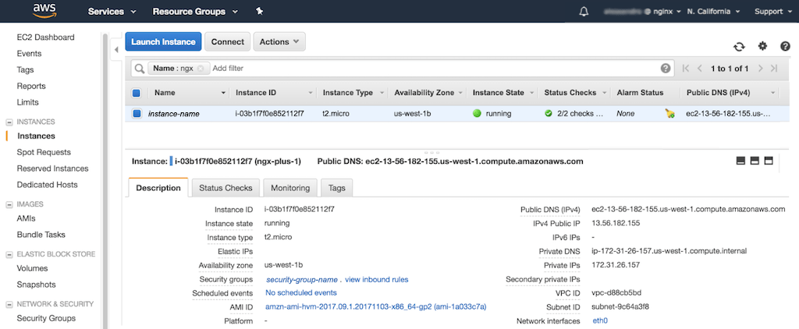
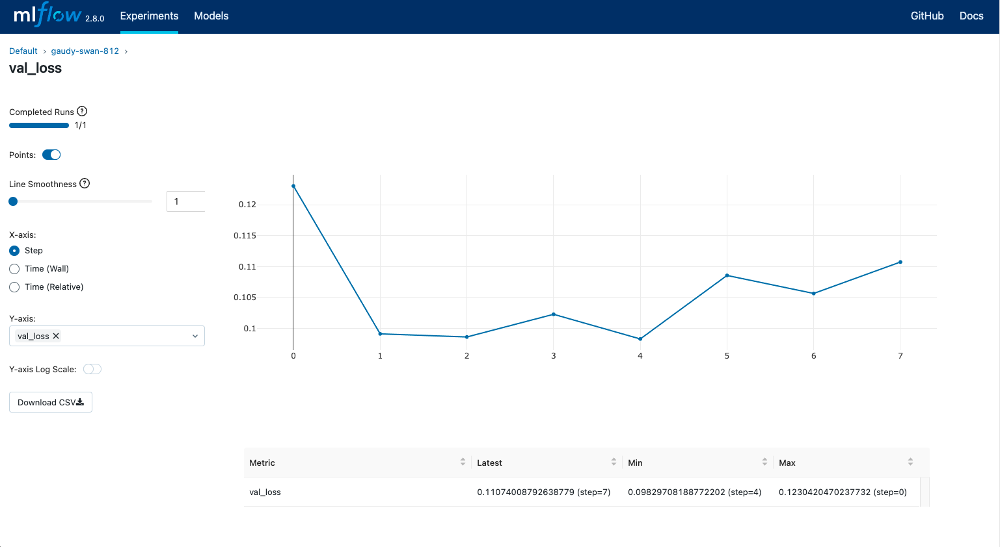
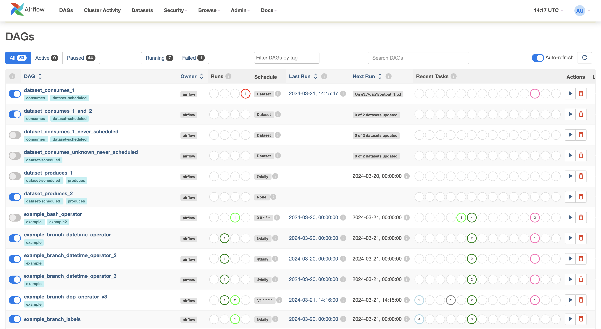

# Harbor Vessel Detection

This project is designed to detect different types of ships and vessels from aerial images using computer vision techniques. The project involves three main steps: preprocessing, training, and prediction. This README provides instructions to get started with running the project on AWS and using MLFlow for experiment tracking. Additionally, it includes guidelines for creating an Airflow pipeline to automate the entire process.

## Prerequisites
- AWS account with access to S3 and EC2
- Python 3.8+
- AWS CLI
- Boto3
- MLFlow
- Apache Airflow

## Setup Instructions

### Setup AWS CLI, Boto3, and Airflow
1. **Install AWS CLI:**
    ```bash
    sudo apt-get install awscli
    ```

2. **Install Boto3:**
    ```bash
    pipx install boto3
    ```

3. **Install Airflow:**
    ```bash
    pipx install apache-airflow
    ```

### Request Access to S3 Bucket
To access the test dataset stored in an S3 bucket, request access by submitting a JIRA ticket

Generate temporary credentials using the AWS Security Token Service (STS) and configure Boto3.

1. **Generate Temporary Credentials:**
    ```bash
    aws sts get-session-token --duration-seconds 36000
    ```

2. **Configure Boto3:**
    ```python
    import boto3

    session = boto3.Session(
        aws_access_key_id='YOUR_ACCESS_KEY',
        aws_secret_access_key='YOUR_SECRET_KEY',
        aws_session_token='YOUR_SESSION_TOKEN'
    )
    s3 = session.resource('s3')
    ```

### Provision an EC2 GPU Machine
1. **Launch an EC2 Instance:**
    - Choose an instance type with GPU (e.g., `p3.2xlarge`).
    - Configure security group and key pair.
        - Remember to allow access to port 22 from our internal network.

2. **Connect to the Instance:**
    ```bash
    ssh -i "your-key-pair.pem" ec2-user@your-ec2-instance-public-dns
    ```


### Clone the Repository
1. **Install Git:**
    ```bash
    sudo yum install git -y
    ```

2. **Clone the Repository:**
    ```bash
    git clone https://github.com/your-username/harbor-object-detection.git
    cd harbor-object-detection
    ```

> Remember to commit your changes to Git periodically!

> Remember to shut down the machine, when you no longer needed!

### Setup MLFlow
1. **Check for Existing MLFlow Server:**
   Before setting up a new MLFlow server, check with your team if there is already a shared MLFlow server available.

2. **Setup MLFlow Server on a Separate EC2 Instance:**

    1. **Launch an EC2 Instance:**
        - Choose an instance type (e.g., `t2.medium`).
        - Configure security group and key pair.

    2. **Connect to the Instance:**
        ```bash
        ssh -i "your-key-pair.pem" ec2-user@your-mlflow-instance-public-dns
        ```

    3. **Install Dependencies:**
        ```bash
        sudo yum install git -y
        sudo yum install -y python3
        pip3 install mlflow boto3
        ```

    4. **Clone the Repository (optional, if you want to manage from the same repo):**
        ```bash
        git clone https://github.com/your-username/harbor-object-detection.git
        cd harbor-object-detection
        ```

    5. **Configure MLFlow Tracking:**

        > Request seperate authentication credentials for this, so you're not passing your personal access keys!

        ```bash
        export MLFLOW_S3_ENDPOINT_URL=https://s3.amazonaws.com
        export AWS_ACCESS_KEY_ID=your-access-key-id
        export AWS_SECRET_ACCESS_KEY=your-secret-access-key
        export MLFLOW_TRACKING_URI=http://your-mlflow-server:5000
        ```

    6. **Start MLFlow Server:**
        ```bash
        mlflow server \
          --backend-store-uri sqlite:///mlflow.db \
          --default-artifact-root s3://your-s3-bucket/mlflow/ \
          --host 0.0.0.0
        ```

3. **Configure KMS Key for S3 Backend:**
    Ensure that your S3 bucket is configured to use a KMS key for encryption. Add the KMS key configuration to your `.env` file:
    ```bash
    export MLFLOW_S3_ENCRYPTION_KEY=your-kms-key-id
    ```



## Running the Project

### Preprocessing
```bash
python preprocess.py --csv_path data/raw/labels.csv --images_path data/raw/images.zip --output_path data/processed/dataset.npz
```

### Training
```bash
python train_model.py --input_path data/processed/dataset.npz --epochs 50 --learning_rate 0.001 --batch_size 32 --dataset_name harbor_dataset
```

### Prediction
```bash
python predict.py --model_path models/harbor_model.h5 --test_data data/processed/dataset_test.npz --output_path predictions/
```

## Save Artifacts to S3 via MLFlow
1. **Log Artifacts:**
    ```python
    import mlflow

    with mlflow.start_run():
        mlflow.log_param("epochs", 50)
        mlflow.log_param("learning_rate", 0.001)
        mlflow.log_artifact("models/harbor_model.h5")
        mlflow.log_artifact("predictions/")
    ```

2. **Save Model to S3:**
    ```bash
    mlflow artifacts download -r your-run-id -o s3://your-s3-bucket/mlflow-artifacts/
    ```

## Airflow Pipeline



### Define the Pipeline
1. **Install Airflow:**
    ```bash
    pipx install apache-airflow
    ```

2. **Create a DAG:**
    ```python
    from airflow import DAG
    from airflow.operators.python_operator import PythonOperator
    from datetime import datetime
    import boto3
    import os

    def download_data():
        s3 = boto3.client('s3')
        s3.download_file('your-s3-bucket', 'data/raw/labels.csv', '/path/to/labels.csv')
        s3.download_file('your-s3-bucket', 'data/raw/images.zip', '/path/to/images.zip')

    def preprocess():
        import subprocess
        subprocess.run(["python", "preprocess.py", "--csv_path", "/path/to/labels.csv", "--images_path", "/path/to/images.zip", "--output_path", "data/processed/dataset.npz"])

    def train():
        import subprocess
        subprocess.run(["python", "train_model.py", "--input_path", "data/processed/dataset.npz", "--epochs", "50", "--learning_rate", "0.001", "--batch_size", "32", "--dataset_name", "harbor_dataset"])

    def predict():
        import subprocess
        subprocess.run(["python", "predict.py", "--model_path", "models/harbor_model.h5", "--test_data", "data/processed/dataset_test.npz", "--output_path", "predictions/"])

    default_args = {
        'owner': 'airflow',
        'start_date': datetime(2023, 1, 1),
        'retries': 1,
    }

    dag = DAG('harbor_detection_pipeline', default_args=default_args, schedule_interval='@daily')

    download_task = PythonOperator(
        task_id='download_data',
        python_callable=download_data,
        dag=dag,
    )

    preprocess_task = PythonOperator(
        task_id='preprocess',
        python_callable=preprocess,
        dag=dag,
    )

    train_task = PythonOperator(
        task_id='train',
        python_callable=train,
        dag=dag,
    )

    predict_task = PythonOperator(
        task_id='predict',
        python_callable=predict,
        dag=dag,
    )

    download_task >> preprocess_task >> train_task >> predict_task
    ```

3. **Deploy the DAG:**
    - Save the DAG file (e.g., `harbor_detection_dag.py`) to the Airflow DAGs folder.
    - Start the Airflow web server and scheduler.

By following these instructions, you can set up and run the Harbor Object Detection Project on AWS with MLFlow tracking and automate the workflow using Airflow.
