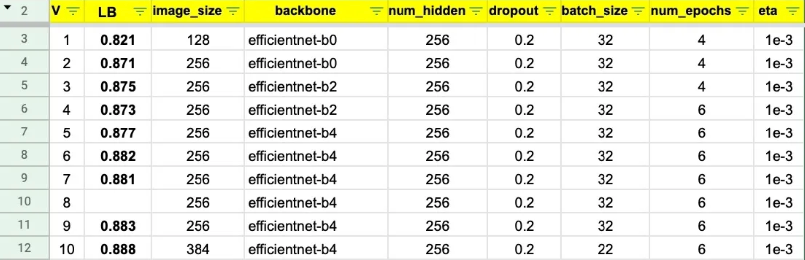

# Harbor Object Detection Project

This project is designed to detect different types of ships and vessels from aerial images using computer vision techniques. The project involves three main steps: preprocessing, training, and prediction. This README provides instructions to get started with running the project on Microsoft Azure and using Weights and Biases (wandb) for experiment tracking. Additionally, it includes guidelines for creating a Kubeflow pipeline to automate the entire process.

## Prerequisites
- Microsoft Azure account with access to Azure Storage and Azure Virtual Machines
- Python 3.8+
- Azure CLI

## Setup Instructions

### Request Access to Azure Storage
To access the test dataset stored in an Azure Storage account, request access from your Azure administrator. Generate temporary credentials using the Azure CLI and configure the Azure Storage client.

1. **Authenticate with Azure:**
    ```bash
    az login
    ```

2. **Set the Subscription:**
    ```bash
    az account set --subscription YOUR_SUBSCRIPTION_ID
    ```

3. **Configure Azure Storage Client:**
    ```python
    from azure.storage.blob import BlobServiceClient

    connection_string = "your_connection_string"
    blob_service_client = BlobServiceClient.from_connection_string(connection_string)
    container_client = blob_service_client.get_container_client("your-container")
    ```

### Provision a Virtual Machine
1. **Launch a Virtual Machine:**
    - Choose a machine type with GPU (e.g., `Standard_NC6`).
    - Configure network security group and SSH keys.

2. **Connect to the Instance:**
    ```bash
    ssh -i "your-key-pair.pem" your-username@your-vm-public-ip
    ```

### Clone the Repository
1. **Install Git:**
    ```bash
    sudo apt-get install git -y
    ```

2. **Clone the Repository:**
    ```bash
    git clone https://github.com/your-username/harbor-object-detection.git
    cd harbor-object-detection
    ```

### Setup Azure CLI
1. **Install Azure CLI:**
    ```bash
    curl -sL https://aka.ms/InstallAzureCLIDeb | sudo bash
    ```

## Running the Project

After you've SSH'd into the the machine and cloned your Git commit there, you can run your jobs.

### Preprocessing
```bash
python preprocessing.py --csv_path data/raw/labels.csv --images_path data/raw/images.zip --output_path data/processed/dataset.npz
```

### Training
```bash
python training.py --input_path data/processed/dataset.npz --epochs 50 --learning_rate 0.001 --batch_size 32 --dataset_name harbor_dataset
```

### Prediction
```bash
python prediction.py --model_path models/harbor_model.h5 --test_data data/processed/dataset_test.npz --output_path predictions/
```

## Keep track of metrics

Update your CSV file with your experiment information and metrics.



## Chaining jobs and pipelining

To be added...