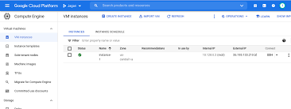
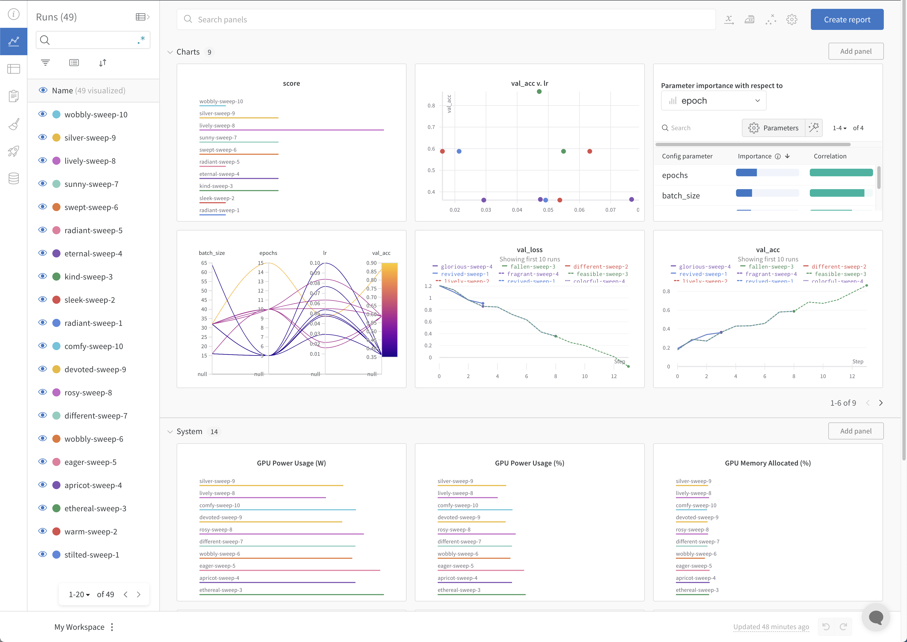
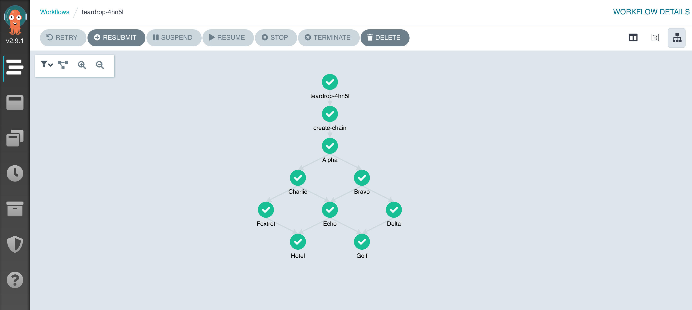

# Harbor Vessel Detection

This project is designed to detect different types of ships and vessels from aerial images using computer vision techniques. The project involves three main steps: preprocessing, training, and prediction. This README provides instructions to get started with running the project on GCP and using Weights and Biases for experiment tracking. Additionally, it includes guidelines for creating an Argo Workflows pipeline to automate the entire process.

## Prerequisites
- GCP account with access to GCS and Compute Engine
- Python 3.8+
- gcloud CLI
- Weights and Biases (wandb)
- Argo Workflows

## Setup Instructions

### Setup gcloud CLI and Argo Workflows
1. **Install gcloud CLI:**
    ```bash
    sudo apt-get install google-cloud-sdk
    ```

2. **Install Argo Workflows:**
    ```bash
    curl -sLO https://github.com/argoproj/argo-workflows/releases/download/v3.1.0/argo-linux-amd64
    chmod +x argo-linux-amd64
    sudo mv ./argo-linux-amd64 /usr/local/bin/argo
    ```

### Request Access to GCS Bucket
To access the test dataset stored in a GCS bucket, request access by submitting a support ticket.

Generate temporary credentials using the gcloud CLI and configure Boto3.

1. **Generate Temporary Credentials:**
    ```bash
    gcloud auth application-default login
    ```

2. **Configure Boto3:**
    ```python
    from google.auth import default
    import boto3

    credentials, project = default()

    session = boto3.Session(
        aws_access_key_id=credentials.token,
        aws_secret_access_key=credentials.token,
        aws_session_token=credentials.token
    )
    s3 = session.resource('s3')
    ```

### Provision a Compute Engine GPU Instance
1. **Launch a Compute Engine Instance:**
    - Choose an instance type with GPU (e.g., `n1-standard-4` with `NVIDIA Tesla K80`).
    - Configure firewall rules and SSH keys.
        - Remember to allow access to port 22 from your IP.

2. **Connect to the Instance:**
    ```bash
    gcloud compute ssh your-instance-name --zone=your-zone
    ```



### Clone the Repository
1. **Install Git:**
    ```bash
    sudo apt-get install git -y
    ```

2. **Clone the Repository:**
    ```bash
    git clone https://github.com/your-username/harbor-object-detection.git
    cd harbor-object-detection
    ```

> Remember to commit your changes to Git periodically!

> Remember to shut down the machine, when you no longer need it!

### Setup Weights and Biases
1. **Install Weights and Biases:**
    ```bash
    pip install wandb
    ```

2. **Login to Weights and Biases:**
    ```bash
    wandb login
    ```

3. **Configure Weights and Biases:**
    ```python
    import wandb

    wandb.init(project="harbor-vessel-detection")
    ```

## Running the Project

### Preprocessing
```bash
python preprocess.py --csv_path data/raw/labels.csv --images_path data/raw/images.zip --output_path data/processed/dataset.npz
```

### Training
```bash
python train_model.py --input_path data/processed/dataset.npz --epochs 50 --learning_rate 0.001 --batch_size 32 --dataset_name harbor_dataset
```

### Prediction
```bash
python predict.py --model_path models/harbor_model.h5 --test_data data/processed/dataset_test.npz --output_path predictions/
```

## Save Artifacts to GCS via Weights and Biases
1. **Log Artifacts:**
    ```python
    import wandb

    with wandb.init(project="harbor-vessel-detection"):
        wandb.config.epochs = 50
        wandb.config.learning_rate = 0.001
        wandb.log_artifact("models/harbor_model.h5")
        wandb.log_artifact("predictions/")
    ```



## Argo Workflows Pipeline



### Define the Pipeline
1. **Create a Workflow Template:**
    ```yaml
    apiVersion: argoproj.io/v1alpha1
    kind: Workflow
    metadata:
      generateName: harbor-detection-pipeline-
    spec:
      entrypoint: pipeline
      templates:
      - name: pipeline
        dag:
          tasks:
          - name: download-data
            template: download-data
          - name: preprocess
            template: preprocess
            dependencies: [download-data]
          - name: train
            template: train
            dependencies: [preprocess]
          - name: predict
            template: predict
            dependencies: [train]

      - name: download-data
        script:
          image: python:3.8
          command: [python]
          source: |
            import boto3
            s3 = boto3.client('s3')
            s3.download_file('your-gcs-bucket', 'data/raw/labels.csv', '/path/to/labels.csv')
            s3.download_file('your-gcs-bucket', 'data/raw/images.zip', '/path/to/images.zip')

      - name: preprocess
        script:
          image: python:3.8
          command: [python]
          source: |
            import subprocess
            subprocess.run(["python", "preprocess.py", "--csv_path", "/path/to/labels.csv", "--images_path", "/path/to/images.zip", "--output_path", "data/processed/dataset.npz"])

      - name: train
        script:
          image: python:3.8
          command: [python]
          source: |
            import subprocess
            subprocess.run(["python", "train_model.py", "--input_path", "data/processed/dataset.npz", "--epochs", "50", "--learning_rate", "0.001", "--batch_size", "32", "--dataset_name", "harbor_dataset"])

      - name: predict
        script:
          image: python:3.8
          command: [python]
          source: |
            import subprocess
            subprocess.run(["python", "predict.py", "--model_path", "models/harbor_model.h5", "--test_data", "data/processed/dataset_test.npz", "--output_path", "predictions/"])
    ```

2. **Submit the Workflow:**
    ```bash
    argo submit -n argo harbor-detection-pipeline.yaml
    ```

By following these instructions, you can set up and run the Harbor Object Detection Project on GCP with Weights and Biases tracking and automate the workflow using Argo Workflows.
